# 🛡️ Homelab Blue Team — Proyecto 01: Proxmox + Wazuh SIEM

> **Portfolio de Ciberseguridad** | Wilber Vidal  
> Formación: CertiPlus Cybersecurity Expert · Beca Talento Digital (INDOTEL) · Diplomado en Ciberseguridad y Ciberdefensa (Ministerio de Defensa, Rep. Dom.)

---

## 📋 Descripción del Proyecto

Construcción desde cero de un homelab de Blue Team sobre hardware físico reciclado (mini PC de empresa). El objetivo es desplegar un entorno realista de monitorización de seguridad con Proxmox VE como hipervisor, Wazuh SIEM como plataforma de detección, y un endpoint Windows 11 como objetivo de monitorización.

**Objetivo principal:** Demostrar competencias prácticas en:
- Virtualización con Proxmox/KVM
- Despliegue y configuración de SIEM (Wazuh)
- Monitorización de endpoints Windows
- Resolución de problemas reales en entornos de producción

---

## 🖥️ Hardware Utilizado

| Componente | Especificación |
|---|---|
| **Equipo** | HP EliteDesk 800 G3 DM 35W (mini PC) |
| **CPU** | Intel Core i5-7500T @ 2.70 GHz (7ª gen), VT-x habilitado |
| **RAM** | 12 GB (11.9 GB utilizables) |
| **Almacenamiento** | NVMe 256 GB + SSHD 500 GB |
| **Red** | Gigabit Ethernet |
| **Equipo de trabajo** | Laptop HP Pavilion Gaming con Xubuntu |

---

## 🏗️ Arquitectura del Laboratorio

```
Internet
    │
    ▼
Router Claro (10.0.0.1)
    │  DHCP con reservas estáticas por MAC
    │
    ▼
HP EliteDesk 800 G3 — Proxmox VE 9.2.2 (10.0.0.50)
    ├── NVMe 256 GB → local-lvm (LVM-Thin) → VMs + CT
    └── SSHD 500 GB → sshd-backups (Directory) → Backups/ISOs
         │
         ├── VM 100 — Ubuntu Server 26.04.1 LTS
         │     └── Wazuh 4.14.8 Single-Node
         │           ├── Wazuh Manager
         │           ├── Wazuh Indexer (OpenSearch)
         │           └── Wazuh Dashboard (10.0.0.51:443)
         │
         └── VM 101 — Windows 11 Tiny11 (10.0.0.30)
               └── Wazuh Agent 4.14.8 ← ACTIVO
```

---

## 🔧 Stack Tecnológico

| Componente | Versión | Rol |
|---|---|---|
| Proxmox VE | 9.2.2 | Hipervisor bare-metal |
| Ubuntu Server | 26.04.1 LTS | SO base para Wazuh |
| Wazuh | 4.14.8 | SIEM / Manager / Indexer / Dashboard |
| Windows 11 | Tiny11 (22621.2283) | Endpoint monitorizado |
| VirtIO | 0.1.302 | Drivers de red KVM para Windows |
| Remmina | — | Cliente RDP desde Xubuntu |

---

## 📁 Estructura del Repositorio

```
homelab-proyecto-01/
├── README.md                    ← Este archivo
└── capturas/
    ├── 01-… a 11-…  (Proxmox, red, almacenamiento)
    ├── 20-wazuh-script-interno.png
    ├── 21-wazuh-script-descarga-xubuntu-error.png
    ├── 22-wazuh-script-descarga-correcto.png
    ├── 23-wazuh-instalacion-inicio.png
    ├── 24-wazuh-instalado-credenciales.png
    ├── 25-wazuh-dashboard.png
    ├── 26-proxmox-ram-disponible.png
    ├── 27-windows-setup.png
    ├── 28-windows-escritorio.png
    ├── 29-wazuh-dashboard-sesion.png
    ├── 30-wazuh-deploy-agente-cmd.png
    ├── 31-windows-netkvm-driver.png
    ├── 32-windows-wazuh-agent-ps-instalando.png
    ├── 33-windows-rdp-remmina.png
    ├── 34-windows-wazuh-agent-activo-ps.png
    └── 35-wazuh-agente-activo-dashboard.png
```

---

## 🚀 Fases de Implementación

### Fase 1 — Preparación del Hardware y Proxmox

El equipo es un HP EliteDesk 800 G3 DM de segunda mano, adquirido para el homelab. Se verificó que el procesador tuviera soporte de virtualización por hardware (VT-x) antes de proceder.

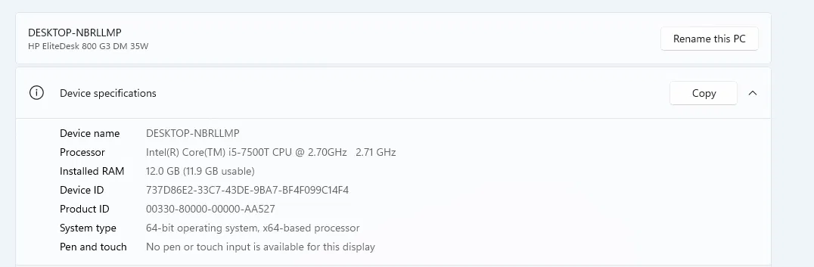
*Especificaciones del equipo: HP EliteDesk 800 G3 DM 35W, i5-7500T, 12 GB RAM*

Durante el instalador de Proxmox se configuró país/zona horaria y la red de gestión con IP fija `10.0.0.50/24`, gateway y DNS apuntando al router (`10.0.0.1`), hostname `pve.lab.local`.

| Zona horaria y teclado | Red de gestión |
|---|---|
| 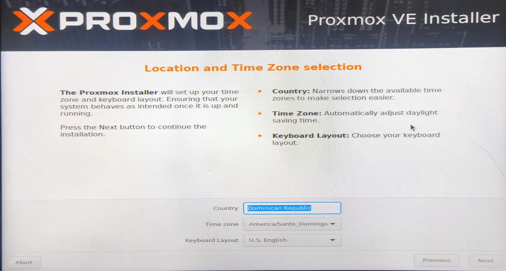 | 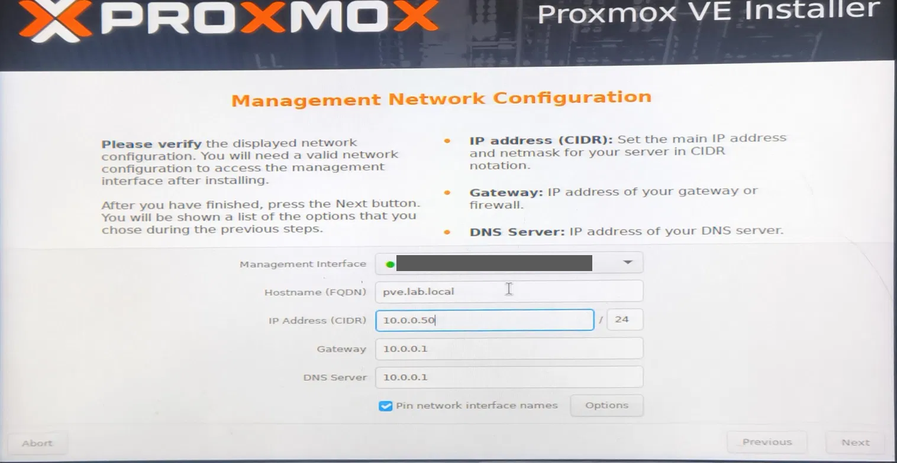 |

Tras el primer reinicio se accede a la interfaz web en `https://10.0.0.50:8006`:

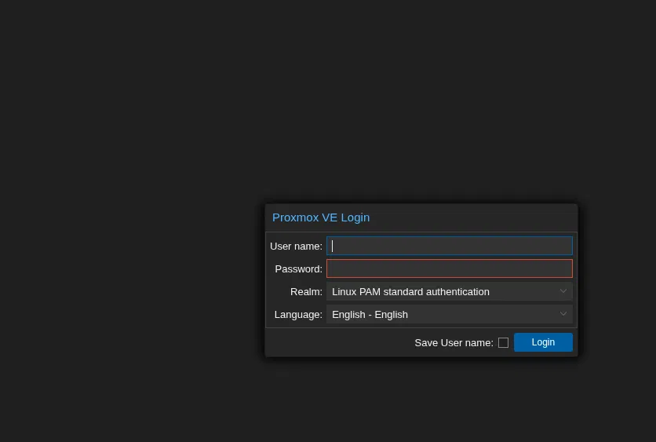

**Verificación de VT-x en Proxmox:**
```bash
egrep -c '(vmx|svm)' /proc/cpuinfo
# Resultado: 8  ← virtualización por hardware habilitada
```

| Guía consultada | Resultado en el host |
|---|---|
| 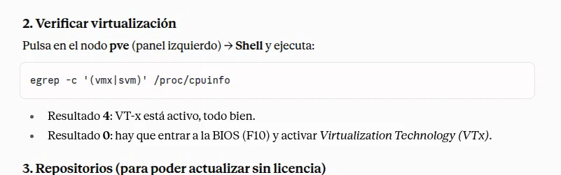 | 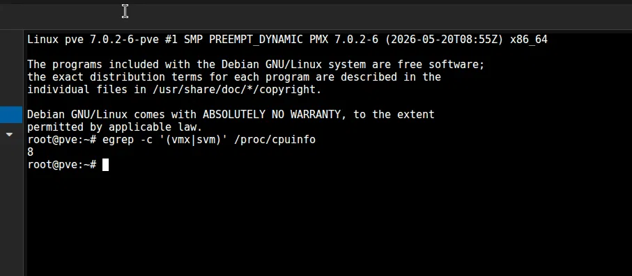 |

**Repositorios:** se desactivaron los repositorios *enterprise* (requieren suscripción) y se habilitó `pve-no-subscription` para poder actualizar el sistema (Debian trixie).

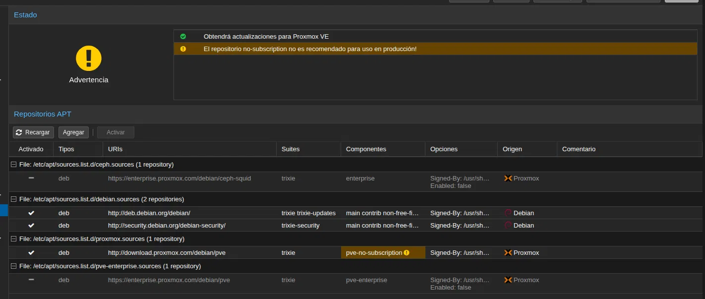

Proxmox VE 9.2.2 se instaló desde USB booteable. Se omitió documentar la creación del USB y configuración de BIOS por ser pasos estándar.

---

### Fase 2 — Configuración de Almacenamiento en Proxmox

El equipo tiene dos discos:
- **NVMe 256 GB** → usado para VMs (LVM-Thin, ya configurado por el instalador de Proxmox como `local-lvm`)
- **SSHD 500 GB** → configurado manualmente como almacenamiento de backups e ISOs

Identificación de los discos con `lsblk`: `nvme0n1` (238.5 GB, sistema + LVM) y `sda` (465.8 GB, SSHD sin formatear).

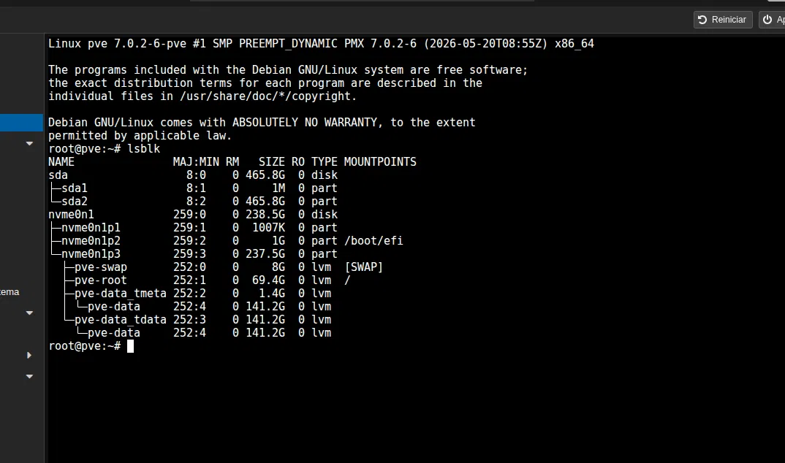

**Particionado del SSHD (sin `parted`, usando `sgdisk`):**

> 💡 *Proxmox no incluye `parted` por defecto. Se usó `sgdisk` del paquete `gdisk`.*

```bash
wipefs -a /dev/sda
sgdisk -Z /dev/sda
sgdisk -n 1:0:0 -t 1:8300 /dev/sda
mkfs.ext4 /dev/sda1
```

**Montaje permanente en `/etc/fstab`:**
```bash
mkdir -p /mnt/sshd-backups
echo '/dev/sda1  /mnt/sshd-backups  ext4  defaults  0  2' >> /etc/fstab
mount -a
```

**Registro del storage en Proxmox:**
```
Datacenter → Storage → Add → Directory
  ID: sshd-backups
  Directory: /mnt/sshd-backups
  Content: Disk image, ISO image, Backup
```

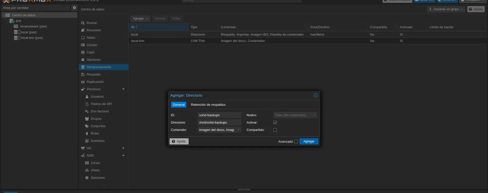

Resultado final con los tres almacenamientos (`local`, `local-lvm`, `sshd-backups`):

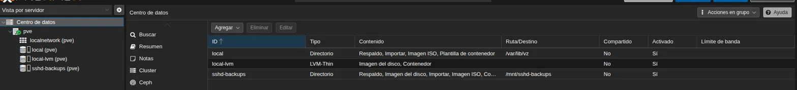

---

### Fase 3 — Red: Reservas DHCP en Router Claro

Para tener IPs fijas sin configurar IPs estáticas en cada VM, se configuraron reservas DHCP en el router Claro del hogar usando las MACs de cada VM.

| Dispositivo | MAC | IP Asignada |
|---|---|---|
| Proxmox Host | (MAC del host) | 10.0.0.50 |
| VM Wazuh (Ubuntu) | (MAC VirtIO) | 10.0.0.51 |
| VM Windows 11 | (MAC VirtIO) | 10.0.0.30 |

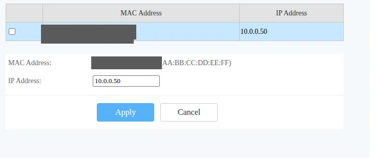
*Reserva DHCP en el router Claro para el host Proxmox (MAC ocultada)*

> ⚠️ *Las MACs reales han sido omitidas de esta documentación por privacidad.*

---

### Fase 4 — VM Ubuntu Server + Wazuh 4.14.8

#### 4.1 Creación de la VM en Proxmox

```
VM 100 — wazuh-server
  CPU: 2 cores
  RAM: 8 GB
  Disco: 80 GB (local-lvm, VirtIO)
  Red: VirtIO (bridge vmbr0)
  ISO: ubuntu-26.04.1-live-server-amd64.iso
```

Ubuntu Server 26.04.1 LTS se instaló con configuración mínima: perfil de usuario `wilber`, hostname `wazuh-server`, sin instalación de paquetes adicionales.

#### 4.2 Problema: CDN de Wazuh bloqueado geográficamente

Al intentar descargar el script de instalación directamente en la VM Ubuntu, el servidor de paquetes de Wazuh devolvía error 403 (bloqueo geográfico en el Caribe).

**Solución:** Descargar desde el laptop Xubuntu y transferir vía SCP a la VM.

```bash
# En Xubuntu (laptop de trabajo):
curl -sO https://packages.wazuh.com/4.14/wazuh-install.sh
ls -lh wazuh-install.sh
# -rw-rw-r-- 1 wilber ... 211K Oct 8 19:43 wazuh-install.sh ✓

# Transferir a la VM Wazuh:
scp wazuh-install.sh wilber@10.0.0.51:~/
```

> ⚠️ *Intentos fallidos previos descargaron el script con 0 o 14 bytes por usar URLs incorrectas.*

**Capturas del proceso:**

| Captura | Descripción |
|---|---|
| 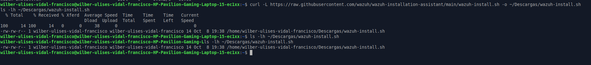 | Primer intento: script de 14 bytes (URL incorrecta) |
| 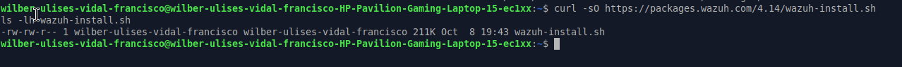 | Descarga correcta: 211KB desde packages.wazuh.com/4.14 |

#### 4.3 Instalación de Wazuh

```bash
# Con flag -i para ignorar advertencias de SO no soportado y RAM mínima
sudo bash wazuh-install.sh -a -i
```

> ℹ️ *Ubuntu 26.04 no está en la lista de sistemas soportados por Wazuh 4.14.8. El flag `-i` (ignore) permite continuar la instalación.*

La instalación tardó aproximadamente 15-20 minutos. Al finalizar, el instalador mostró las credenciales de acceso.

**Capturas de instalación:**

| Captura | Descripción |
|---|---|
| 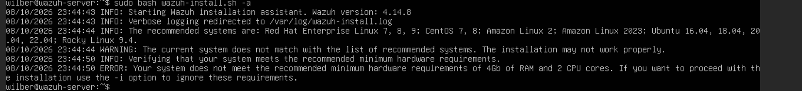 | Inicio del script: advertencia de SO y hardware mínimo |
| 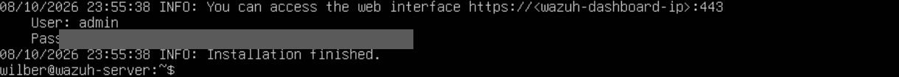 | Instalación completada con credenciales generadas |
| 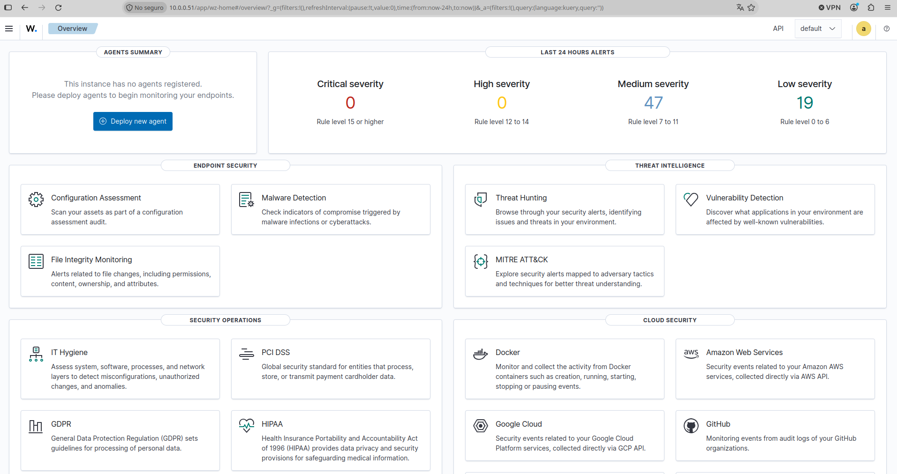 | Wazuh Dashboard funcionando en https://10.0.0.51 |

```
URL: https://10.0.0.51
Usuario: admin
Contraseña: [NO incluida en este repositorio]
```

---

### Fase 5 — VM Windows 11 Tiny11

#### 5.1 Creación de la VM en Proxmox

```
VM 101 — windows-endpoint
  CPU: 2 cores
  RAM: 4 GB
  Disco: 60 GB (local-lvm, VirtIO SCSI)
  Red: VirtIO (bridge vmbr0)
  ISO: tiny11_2311_x64.iso (montada en CD-ROM)
  CD-ROM 2: virtio-win-0.1.302.iso (drivers VirtIO)
```

**Verificación de RAM disponible en el host antes de crear la VM:**

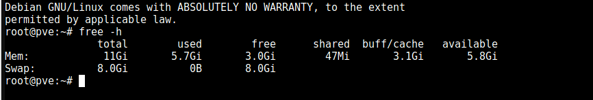
*Proxmox host: 11GB total, 5.7GB usados, 3GB libres + 8GB swap disponibles*

#### 5.2 Instalación de Windows 11 Tiny11

Tiny11 es una versión reducida de Windows 11 ideal para entornos de laboratorio con recursos limitados.

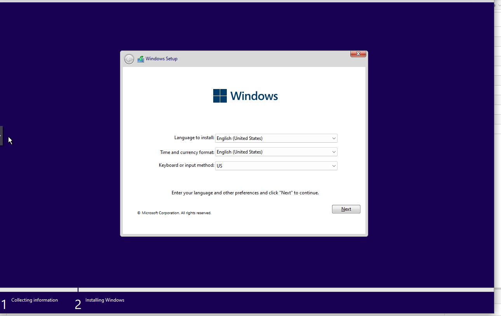
*Pantalla inicial del instalador de Windows*

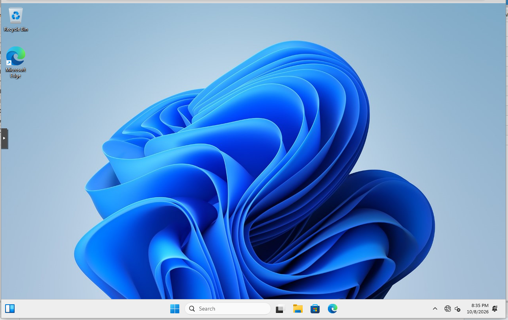
*Windows 11 Tiny11 instalado y en el escritorio — 10/8/2026 8:35 PM*

#### 5.3 Problema: Sin red después de instalar Windows

Después de la instalación, Windows no detectaba ningún adaptador de red. Esto es esperado con NICs VirtIO en KVM: Windows necesita el driver `NetKVM`.

**Solución:** Montar la ISO de VirtIO como segundo CD-ROM e instalar el driver.

```
Explorador de archivos → CD Drive (D:) virtio-win-0.1.302
  → NetKVM → w11 → amd64 → netkvm.inf (clic derecho → Instalar)
```

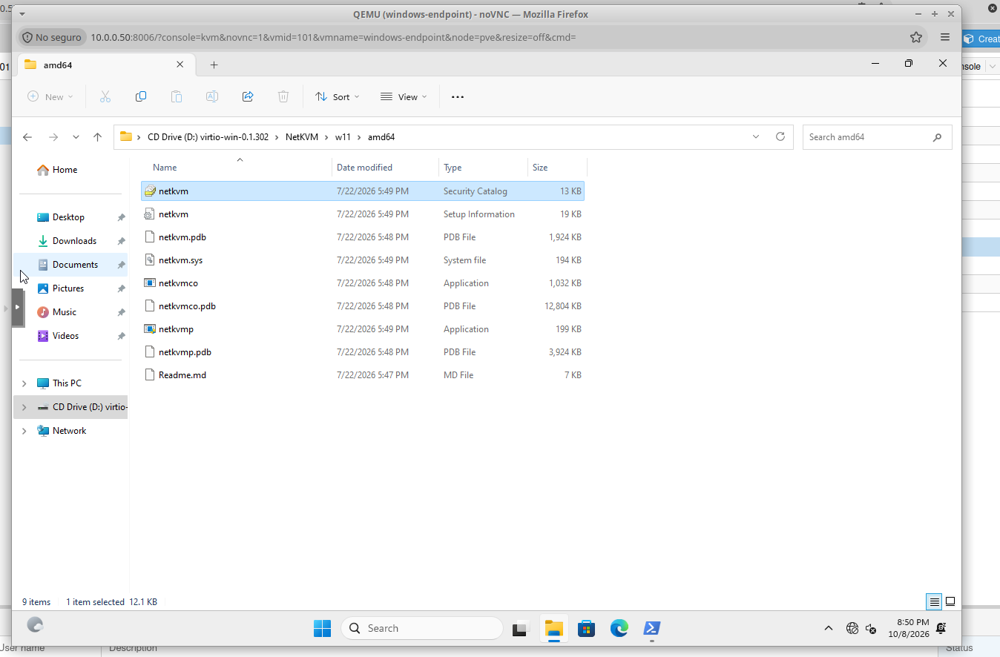
*Carpeta amd64 de NetKVM en el CD virtio-win — seleccionado netkvm (Security Catalog)*

Después de instalar el driver y reiniciar, la VM obtuvo IP `10.0.0.30` por DHCP (reserva preconfigurada en el router).

---

### Fase 6 — Despliegue del Agente Wazuh en Windows

#### 6.1 Obtener el comando de instalación desde el Dashboard

En Wazuh Dashboard → Endpoints → Deploy new agent → Windows → Windows endpoint

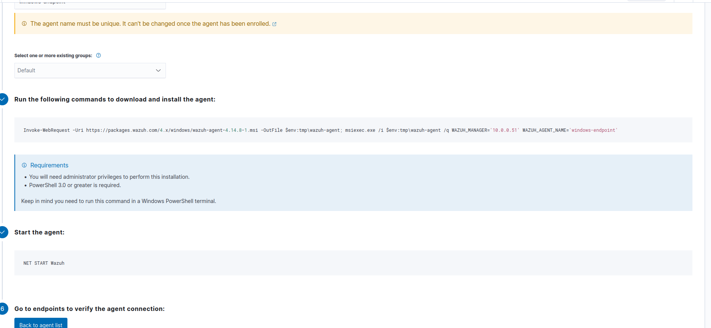
*Comando generado por el Dashboard: Invoke-WebRequest + msiexec con parámetros WAZUH_MANAGER y WAZUH_AGENT_NAME*

#### 6.2 Copiar el comando desde Xubuntu a la VM Windows

El portapapeles no funciona entre el cliente Xubuntu y la consola noVNC de Proxmox. 

**Solución:** Conectarse a la VM Windows por RDP usando Remmina desde Xubuntu, lo que permite copiar y pegar entre los dos sistemas.

```
Remmina → Nueva conexión RDP
  Host: 10.0.0.30
  Usuario: (usuario Windows)
  Contraseña: (contraseña Windows)
```

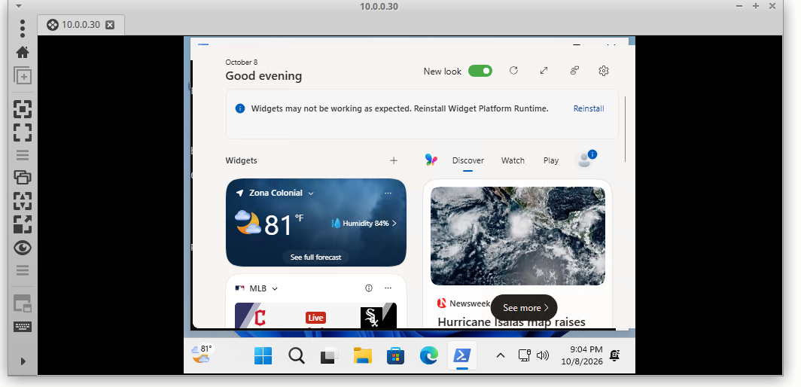
*Conexión RDP desde Xubuntu vía Remmina al Windows endpoint (10.0.0.30)*

#### 6.3 Instalación del agente vía PowerShell

```powershell
# En PowerShell como Administrador en la VM Windows:
Invoke-WebRequest -Uri https://packages.wazuh.com/4.x/windows/wazuh-agent-4.14.8-1.msi `
  -OutFile $env:tmp\wazuh-agent; `
  msiexec.exe /i $env:tmp\wazuh-agent /q `
  WAZUH_MANAGER='10.0.0.51' `
  WAZUH_AGENT_NAME='windows-endpoint'

# Iniciar el servicio:
NET START Wazuh
```

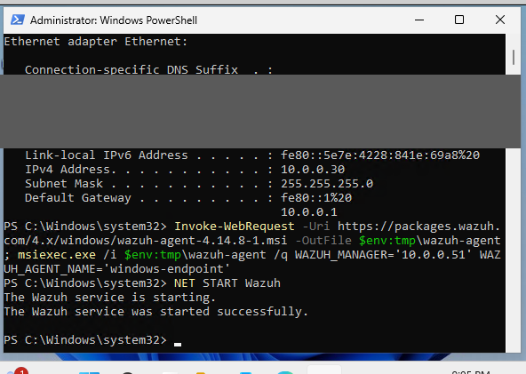
*PowerShell: instalación exitosa + "The Wazuh service was started successfully."*

> 💡 *El primer intento falló porque la VM Windows aún no tenía red (driver NetKVM no instalado). Se instaló el driver primero y se reintentó.*

---

### Fase 7 — Verificación Final en Wazuh Dashboard

Resultado final confirmado en el Wazuh Dashboard:

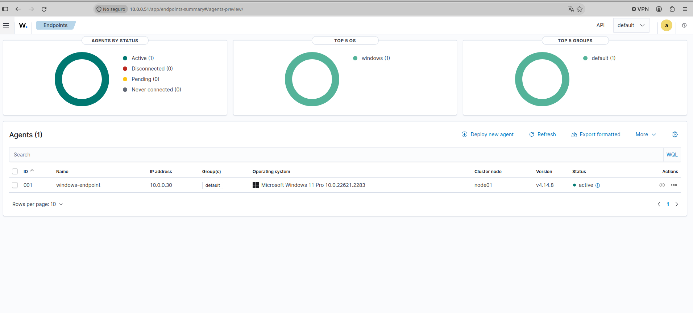

```
Endpoints → Agents (1)
  ID: 001
  Name: windows-endpoint
  IP: 10.0.0.30
  OS: Microsoft Windows 11 Pro 10.0.22621.2283
  Version: v4.14.8
  Status: ● active
  Cluster node: node01
```

**El agente Wazuh está activo y reportando al Manager. El laboratorio está operativo.** ✅

---

## ❌ Problemas Encontrados y Soluciones

| # | Problema | Causa | Solución |
|---|---|---|---|
| 1 | `parted: command not found` en Proxmox | Proxmox no incluye parted | Usar `sgdisk` (`apt install gdisk`) |
| 2 | Wazuh OVA: servicios nunca arrancaban | RAM insuficiente (OVA requiere ~6GB libres, host tenía 12GB en total) | Cambiar a instalación manual sobre Ubuntu Server |
| 3 | Error 403 al descargar `wazuh-install.sh` | CDN de Wazuh bloquea IPs del Caribe | Descargar desde Xubuntu (laptop) y transferir con SCP |
| 4 | Script descargado con 0 o 14 bytes | URL incorrecta usada | URL correcta: `https://packages.wazuh.com/4.14/wazuh-install.sh` |
| 5 | Warning: SO no soportado + RAM mínima | Ubuntu 26.04 no está en lista oficial; VM con 2GB al principio | Flag `-i` en el instalador: `sudo bash wazuh-install.sh -a -i` |
| 6 | Sin red en Windows 11 VM post-install | VirtIO NIC requiere driver en Windows | Montar virtio-win ISO, instalar `NetKVM\w11\amd64\netkvm.inf` |
| 7 | Sin portapapeles en noVNC | Limitación del cliente noVNC | Usar Remmina RDP para copiar/pegar comandos largos |
| 8 | `qm terminal 100` → error "no serial interface" | VM OVA sin puerto serie configurado | `qm set 100 -serial0 socket` (aplicado antes de migrar a Ubuntu) |

---

## 📸 Registro de Capturas

| Archivo | Contenido |
|---|---|
| `01-hardware-specs.png` | Especificaciones del HP EliteDesk 800 G3 DM |
| `02-proxmox-installer-timezone.png` | Instalador Proxmox: país, zona horaria y teclado |
| `03-proxmox-installer-network.png` | Instalador Proxmox: red de gestión 10.0.0.50/24 |
| `04-proxmox-login.png` | Pantalla de login de la interfaz web de Proxmox |
| `05-verificacion-vtx-guia.png` | Guía del comando de verificación de virtualización |
| `06-verificacion-vtx-resultado.png` | Resultado de `egrep -c '(vmx\|svm)' /proc/cpuinfo` = 8 |
| `07-repositorios-no-subscription.png` | Repositorios APT: enterprise desactivados, no-subscription activo |
| `08-lsblk-discos.png` | Discos NVMe y SSHD con `lsblk` |
| `09-storage-agregar-directorio.png` | Alta del storage `sshd-backups` |
| `10-storage-final.png` | Almacenamientos finales en Proxmox |
| `11-router-dhcp-reserva-proxmox.png` | Reserva DHCP del host en el router (MAC ocultada) |
| `20-wazuh-script-interno.png` | Código interno del script wazuh-install.sh (función passwords) |
| `21-wazuh-script-descarga-xubuntu-error.png` | Intento fallido: script de 14 bytes desde URL incorrecta |
| `22-wazuh-script-descarga-correcto.png` | Descarga exitosa: 211KB desde packages.wazuh.com/4.14 |
| `23-wazuh-instalacion-inicio.png` | Inicio instalación Wazuh: advertencias de SO y hardware |
| `24-wazuh-instalado-credenciales.png` | Fin de instalación con credenciales de acceso |
| `25-wazuh-dashboard.png` | Wazuh Dashboard operativo en https://10.0.0.51 |
| `26-proxmox-ram-disponible.png` | RAM disponible en el host antes de crear VM Windows |
| `27-windows-setup.png` | Instalador de Windows 11 Tiny11 en la VM |
| `28-windows-escritorio.png` | Windows 11 instalado — escritorio limpio |
| `29-wazuh-dashboard-sesion.png` | Dashboard con menú de sesión admin visible |
| `30-wazuh-deploy-agente-cmd.png` | Comando de despliegue del agente generado por el Dashboard |
| `31-windows-netkvm-driver.png` | Driver NetKVM en la ISO virtio-win — solución sin red |
| `32-windows-wazuh-agent-ps-instalando.png` | PowerShell: instalando agente (con error DNS previo visible) |
| `33-windows-rdp-remmina.png` | Conexión RDP con Remmina al Windows endpoint |
| `34-windows-wazuh-agent-activo-ps.png` | PowerShell: agente instalado + servicio Wazuh iniciado exitosamente |
| `35-wazuh-agente-activo-dashboard.png` | Dashboard: windows-endpoint activo, IP 10.0.0.30, v4.14.8 |

---

## 🎓 Lecciones Aprendidas

1. **VirtIO en Windows requiere drivers adicionales.** Al crear una VM Windows en KVM/Proxmox con NIC VirtIO, Windows no la reconoce sin los drivers de VirtIO-Win. Siempre tener la ISO de `virtio-win` disponible como segundo CD-ROM durante la instalación.

2. **Los CDNs de proveedores de seguridad pueden bloquear regiones.** Wazuh usa un CDN que bloqueaba peticiones desde IPs de República Dominicana. La solución fue usar un equipo con mejor conectividad como relay de descarga.

3. **El script de Wazuh tiene flags para entornos no estándar.** El flag `-i` permite instalar en SOs no listados oficialmente y en hardware por debajo del mínimo recomendado, útil para laboratorios.

4. **sgdisk vs parted en Proxmox.** Proxmox no incluye `parted` por defecto. `sgdisk` (parte del paquete `gdisk`) es el equivalente para discos GPT y está disponible sin instalación en Proxmox 8.x.

5. **noVNC tiene limitaciones de portapapeles.** Para copiar comandos largos a una VM Windows en Proxmox, RDP (Remmina) es más práctico que la consola noVNC.

6. **Las reservas DHCP por MAC son más simples que IPs estáticas** en un homelab doméstico con un solo router. Permiten mantener IPs fijas sin tocar la configuración de red de cada VM.

7. **La OVA de Wazuh requiere recursos significativos.** Con un host de 12GB de RAM y otras VMs corriendo, la OVA de Wazuh (que requiere ~6GB libres) puede no arrancar correctamente. La instalación manual sobre Ubuntu Server es más controlable.

---

## 🔒 Consideraciones de Seguridad

- ✅ No se han abierto puertos en el router hacia Internet — el laboratorio es completamente interno
- ✅ Las credenciales de Wazuh no están incluidas en este repositorio
- ✅ Las MACs e IPs públicas han sido omitidas de las capturas y documentación
- ✅ Las direcciones IPv6 globales (2001:1308:...) han sido excluidas
- ✅ Todo el tráfico de monitorización es interno a la red 10.0.0.0/24

---

## 🔮 Próximos Pasos

- [ ] **Proyecto 02:** Generar alertas reales — simulación de ataques con Atomic Red Team o similar desde una VM Kali Linux
- [ ] **Proyecto 03:** Configurar reglas personalizadas en Wazuh para detección de comportamientos anómalos
- [ ] **Proyecto 04:** Integrar Suricata IDS como sensor de red y enviar sus logs a Wazuh
- [ ] **Proyecto 05:** Desplegar un servidor vulnerable (Metasploitable/DVWA) y documentar el flujo completo ataque → detección → respuesta
- [ ] Agregar más endpoints al SIEM (VM Linux, contenedor Docker)
- [ ] Configurar alertas por email/Slack desde Wazuh

---

## 📚 Referencias

- [Documentación oficial Wazuh 4.14](https://documentation.wazuh.com/current/)
- [Proxmox VE Wiki](https://pve.proxmox.com/wiki/Main_Page)
- [VirtIO Drivers para Windows en KVM](https://fedorapeople.org/groups/virt/virtio-win/direct-downloads/)
- [Tiny11 — Windows 11 compacto para laboratorio](https://github.com/ntdevlabs/tiny11builder)
- [sgdisk man page](https://www.rodsbooks.com/gdisk/sgdisk-walkthrough.html)

---

*Proyecto documentado el 8 de octubre de 2026 · Homelab Blue Team Novato · Rep. Dominicana*
