# 🎯 Homelab Blue Team — Proyecto 02: Simulación de ataques con Atomic Red Team y análisis de detección en Wazuh

> **Portfolio de Ciberseguridad** | Wilber Vidal  
> Formación: CertiPlus Cybersecurity Expert · Beca Talento Digital (INDOTEL) · Diplomado en Ciberseguridad y Ciberdefensa (Ministerio de Defensa, Rep. Dom.)

---

## 📋 Descripción

Sobre el laboratorio del [Proyecto 01](../01-proxmox-wazuh/README.md) (Proxmox + Wazuh 4.14.8 + endpoint Windows 11), este proyecto responde a una pregunta típica de un analista SOC: **¿qué detecta realmente mi SIEM y qué se le escapa?**

Para medirlo se ejecutan técnicas de ataque reales y controladas con **Atomic Red Team** (Red Canary) en la VM Windows y se revisa, técnica por técnica, si Wazuh genera una alerta, con qué regla y a qué táctica/técnica de **MITRE ATT&CK** la asocia.

**Competencias que demuestra:**
- Emulación de adversarios con Atomic Red Team
- Mapeo de técnicas a MITRE ATT&CK
- Análisis de brechas de detección (*detection gap analysis*)
- Auditoría de Windows (`auditpol`) y registro de PowerShell (Script Block Logging)
- Configuración del agente Wazuh (recolección de canales de eventos adicionales)
- Triage de alertas y reconocimiento de falsos positivos

> ⚠️ **Aviso:** las simulaciones se ejecutaron únicamente en una VM de laboratorio aislada, con snapshot previo en Proxmox. La exclusión de Windows Defender sobre `C:\AtomicRedTeam` es solo para el laboratorio y no debe replicarse en producción.

---

## 🧰 Entorno

| Elemento | Detalle |
|---|---|
| Hipervisor | Proxmox VE 9.2.2 (10.0.0.50) |
| SIEM | Wazuh 4.14.8 single-node (VM 100, 10.0.0.51) |
| Endpoint atacado | Windows 11 Tiny11 (VM 101, `windows-endpoint`, 10.0.0.30, agente 001) |
| Herramienta | Invoke-AtomicRedTeam + biblioteca de atomics |
| Protección | Snapshot `Pre-atomic-red-team` (con RAM) antes de empezar |

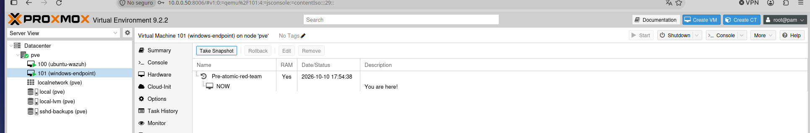

---

## 🧪 Metodología

Para cada técnica se siguió el mismo ciclo:

1. **Predicción:** anotar si se espera que Wazuh alerte o no (y por qué).
2. **Ejecución:** `Invoke-AtomicTest <técnica> -TestNumbers <n>`.
3. **Observación:** Wazuh → *Threat Hunting → Events*, filtrando por `agent.name:windows-endpoint`.
4. **Análisis:** regla disparada, nivel, evento de Windows de origen y mapeo MITRE.
5. **Limpieza:** `Invoke-AtomicTest ... -Cleanup` para revertir los cambios.

> Distinción clave: un **evento** (Windows lo registra) no es una **alerta** (una regla de Wazuh lo considera relevante). Solo los eventos que coinciden con una regla aparecen en el Dashboard.

Instalación (resumen):

```powershell
Add-MpPreference -ExclusionPath "C:\AtomicRedTeam"      # solo laboratorio
Set-ExecutionPolicy Bypass -Scope CurrentUser -Force
IEX (IWR 'https://raw.githubusercontent.com/redcanaryco/invoke-atomicredteam/master/install-atomicredteam.ps1' -UseBasicParsing)
Install-AtomicRedTeam -getAtomics -Force
Import-Module "C:\AtomicRedTeam\invoke-atomicredteam\Invoke-AtomicRedTeam.psd1" -Force
```

---

## 📊 Resumen de resultados

| # | Técnica MITRE ATT&CK | Test | Resultado inicial | Causa / acción | Resultado final |
|---|---|---|---|---|---|
| 1 | **T1136.001** Create Account: Local Account (Persistence) | T1136.001-4 (`net user /add`) | ✅ Detectado | Evento 4720 → familia de reglas 601xx; la regla 60109 se asocia a **T1098** (Account Manipulation) | ✅ Detectado (mapeo MITRE parcial) |
| 2 | **T1053.005** Scheduled Task (Execution/Persistence/Priv. Esc.) | T1053.005-2 (`schtasks /create`) | ❌ Sin alerta | Auditoría "Other Object Access Events" = *No Auditing* → Windows no generaba el evento 4698 | ✅ Detectado tras `auditpol` (regla 60228, nivel 4, **T1053**) |
| 3 | **T1059.001** PowerShell (Execution) | T1059.001-17 (`Write-Host`) | ❌ Sin alerta | Script Block Logging desactivado y canal PowerShell/Operational no recolectado; corregido, pero el evento llega y **ninguna regla lo convierte en alerta** | ⚠️ Brecha de reglas (se aborda en el Proyecto 03) |

---

## 🔍 Detalle de cada prueba

### 1. T1136.001 — Creación de cuenta local (persistencia)

Un atacante que consigue privilegios crea una cuenta propia para volver cuando quiera. El test ejecuta `net user /add T1136.001_CMD`.

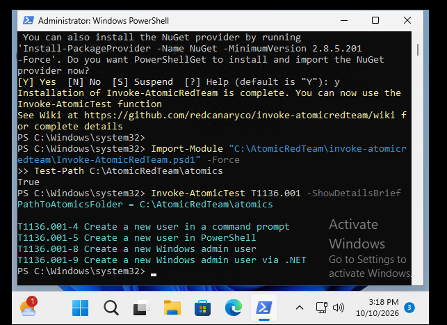
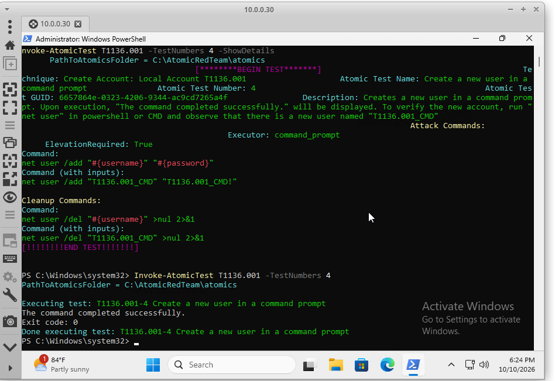

Wazuh generó 4 eventos (creación, cambio y borrado de la cuenta durante el ciclo de ejecución + limpieza):

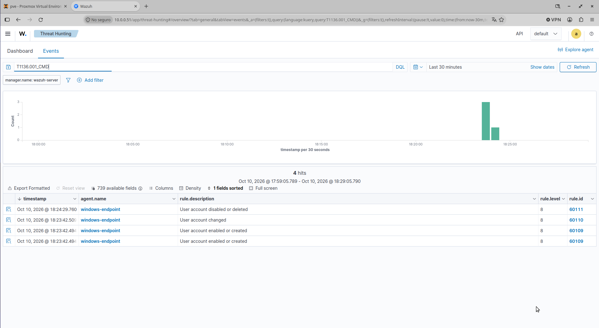

La alerta de creación proviene del evento de Windows **4720** (*A user account was created*) y la regla 60109 la etiqueta con **T1098 – Account Manipulation / Persistence**. Es un mapeo cercano pero no exacto: la técnica emulada es T1136.001.

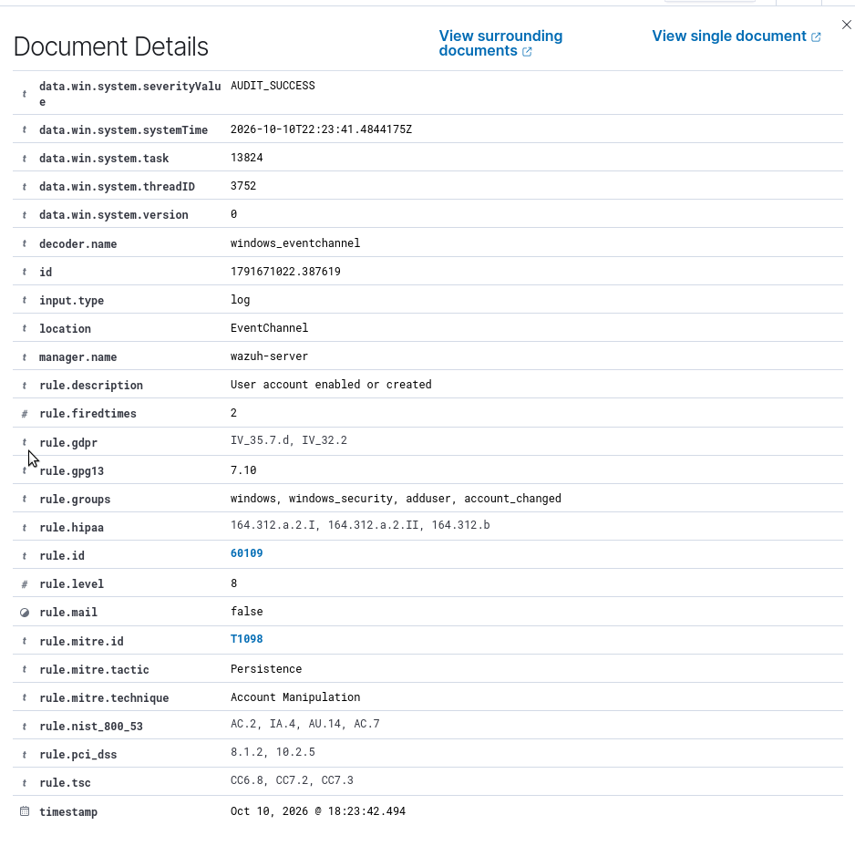

**Lectura del analista:** la detección es buena porque Windows audita la gestión de cuentas por defecto. Un SOC vería quién creó la cuenta (`subjectUserName`) y cuál (`targetUserName`).

### 2. T1053.005 — Tarea programada (antes y después)

**Antes:** el test creó la tarea `spawn`, pero Wazuh no mostró nada.

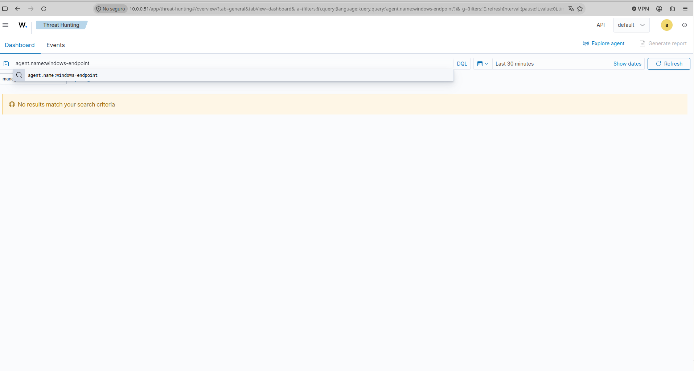

**Diagnóstico:** el evento 4698 (*A scheduled task was created*) pertenece a la subcategoría de auditoría *Other Object Access Events*, que estaba en *No Auditing*. Si Windows no registra el evento, el SIEM no puede alertar.

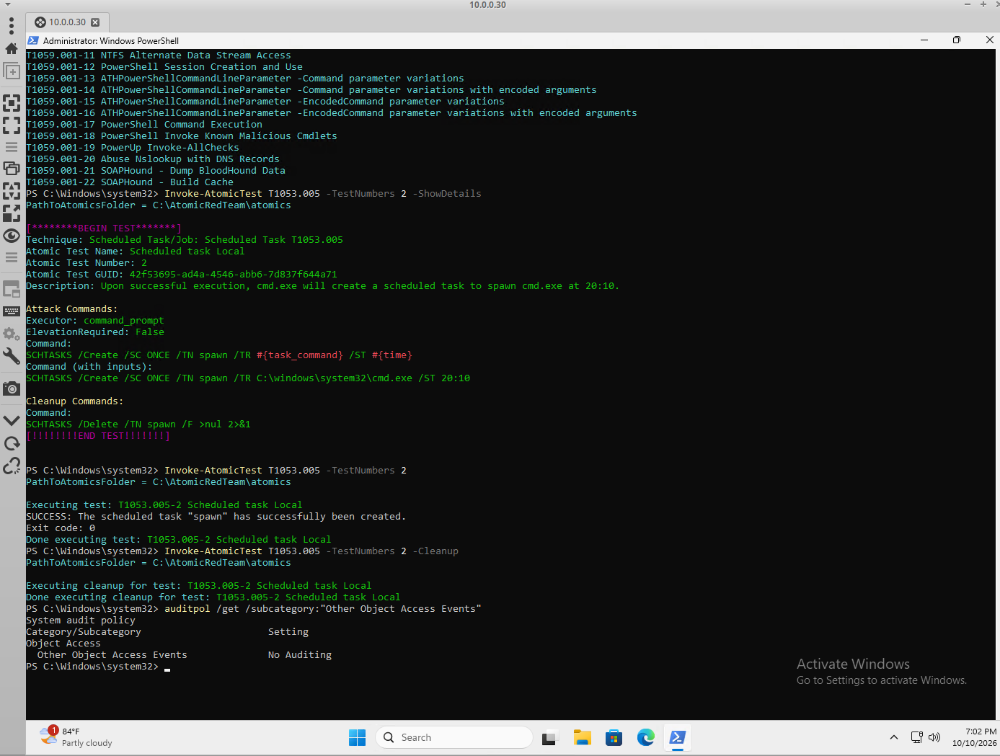

**Corrección:**

```powershell
auditpol /set /subcategory:"Other Object Access Events" /success:enable /failure:enable
```

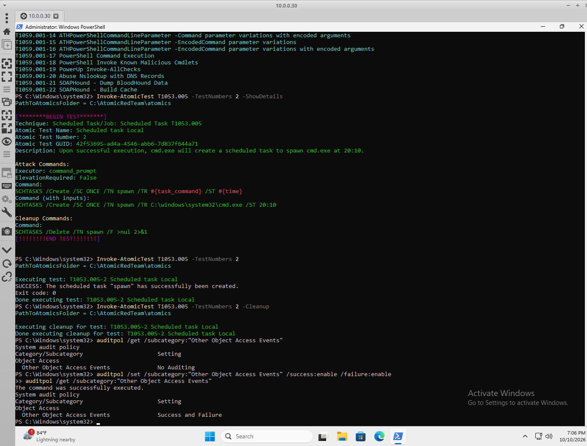

**Después:** al repetir el test, Wazuh dispara la regla **60228** (*A scheduled task was created*), y además la regla 60112 por el cambio de política de auditoría.

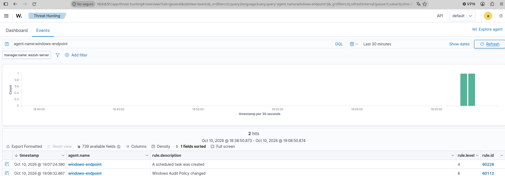
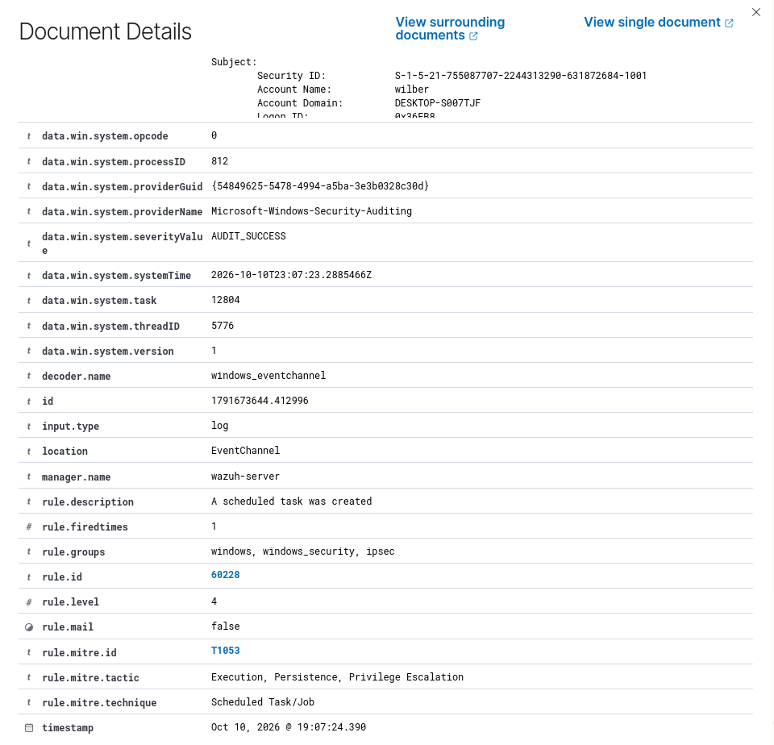

**Lectura del analista:** la detección depende de la **configuración de auditoría del endpoint**. Un hardening básico (CIS) incluye habilitarla.

### 3. T1059.001 — PowerShell (brecha de detección documentada)

El test ejecuta un comando PowerShell sencillo (`Write-Host 'Hello, from PowerShell!'`).

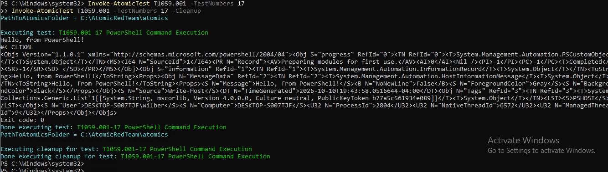

Se investigó capa por capa, cada una con su evidencia:

| Capa | Pregunta | Resultado |
|---|---|---|
| 1. Origen | ¿Windows registra el comando? | Al principio no. Se activó **Script Block Logging** (política de registro `EnableScriptBlockLogging=1`). Tras ello aparece el evento **4104** en `Microsoft-Windows-PowerShell/Operational`. |
| 2. Recolección | ¿El agente Wazuh lee ese canal? | No por defecto. Se añadió un bloque `<localfile>` con `eventchannel` en `ossec.conf` y se reinició el agente (verificado en `ossec.log`). |
| 3. Transporte | ¿Llega el evento al manager? | **Sí.** Se activó temporalmente `logall_json` en el manager y el evento apareció en `archives.json`, decodificado (`windows_eventchannel`) con el `scriptBlockText` completo. |
| 4. Reglas | ¿Alguna regla lo convierte en alerta? | **No.** Ningún conjunto de reglas por defecto alerta sobre este script benigno. |

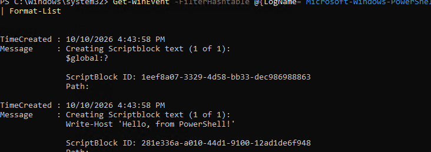
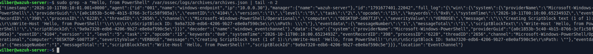

```powershell
# Bloque añadido a ossec.conf (agente Windows)
<localfile>
  <location>Microsoft-Windows-PowerShell/Operational</location>
  <log_format>eventchannel</log_format>
</localfile>
```

**Conclusión:** es una brecha de **reglas**, no de recolección. Detectar PowerShell malicioso exigirá reglas propias (por ejemplo, sobre `-EncodedCommand`, `IEX`, `DownloadString`), lo cual se desarrolla en el Proyecto 03. Tras la prueba, `logall_json` se desactivó y el archivo se eliminó.

---

## ⚠️ Falsos positivos observados

Al activar el canal de PowerShell aparecieron alertas **91816** (*PowerShell script querying system environment variables*, nivel 4, MITRE **T1082 – System Information Discovery**). Parecían ataques, pero se originaban en los **chequeos SCA de Wazuh** (`secedit` ejecutado por PowerShell), no en las pruebas. Se verificó leyendo el `scriptBlockText` del evento.

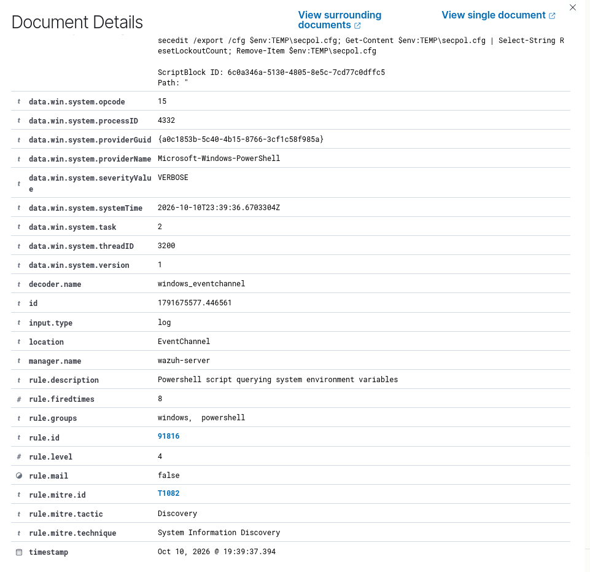

**Aprendizaje:** una alerta con técnica MITRE no es automáticamente un ataque; hay que leer el evento original y correlacionar con la actividad conocida.

---

## ❌ Problemas encontrados y soluciones

| Problema | Causa | Solución |
|---|---|---|
| T1053.005 sin alerta | Auditoría *Other Object Access Events* desactivada | `auditpol /set ...` |
| Sin eventos 4104 | Script Block Logging desactivado | Política en el registro de Windows |
| Canal PowerShell no leído | El agente no lo recolecta por defecto | `<localfile>` + `eventchannel` en `ossec.conf` |
| Agente detenido tras editar `ossec.conf` | Bloque pegado dentro de otro bloque XML | Restaurar el `.bak` e insertar el bloque antes del `</ossec_config>` final |
| Alertas 91816 atribuidas al test | Venían de los chequeos SCA | Comprobar el contenido del script block |
| Horas que no coinciden | Wazuh en UTC, Windows en hora local (UTC-4) | Convertir antes de comparar |

---

## 🧠 Lecciones aprendidas

1. **Visibilidad ≠ detección.** Hay cuatro puntos donde puede romperse: origen (auditoría), recolección (agente), transporte (manager) y reglas.
2. **La configuración del endpoint importa tanto como el SIEM.** Sin auditoría ni logging, el SIEM está ciego.
3. **El mapeo MITRE de Wazuh es parcial** y debe contrastarse con la técnica real.
4. **Las alertas hay que validarlas**: los falsos positivos son parte del trabajo del analista.
5. **Documentar también lo que NO se detecta** es lo que convierte un laboratorio en un análisis de brechas.

---

## 🔭 Próximos pasos

- **Proyecto 03:** Sysmon + reglas y decodificadores personalizados en Wazuh (visibilidad de línea de comandos, PowerShell codificado, ajuste del falso positivo 91816, mayor severidad para tareas programadas).
- Repetir las técnicas tras el hardening (CIS) y comparar la cobertura.

---

## 📸 Registro de capturas

| Archivo | Contenido |
|---|---|
| `01` | Snapshot previo en Proxmox |
| `02`–`03` | Lista y ejecución de T1136.001-4 |
| `04`–`05` | Eventos y regla 60109 (T1098) |
| `06`–`10` | T1053.005: sin detección, diagnóstico, corrección y detección |
| `11`–`13` | T1059.001: ejecución, evento 4104 y evidencia en `archives.json` |
| `14` | Falso positivo 91816 (SCA) |
